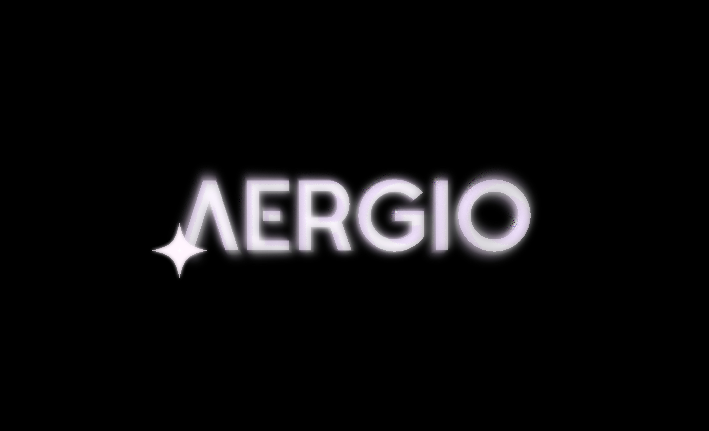

<!-- PROJECT SHIELDS -->
<!--
*** I'm using markdown "reference style" links for readability.
*** Reference links are enclosed in brackets [ ] instead of parentheses ( ).
*** See the bottom of this document for the declaration of the reference variables
*** for contributors-url, forks-url, etc. This is an optional, concise syntax you may use.
*** https://www.markdownguide.org/basic-syntax/#reference-style-links
-->
[![Contributors][contributors-shield]][contributors-url]
[![Forks][forks-shield]][forks-url]
[![Issues][issues-shield]][issues-url]

<!-- PROJECT LOGO -->
 

  
  

<!-- TABLE OF CONTENTS -->

  
Table of Contents

  <ol>
    <li>
      <a href="#about-the-project">About The Project</a>
      <ul>
        <li><a href="#built-with">Built With</a></li>
      </ul>
    </li>
    <li><a href="#contributing">Contributing</a></li>
    <li><a href="#contact">Contact</a></li>
    <li><a href="#acknowledgments">Acknowledgments</a></li>
  </ol>

<!-- ABOUT THE PROJECT -->
## What is AERGIO?

[![Product Name Screen Shot][product-screenshot]](https://example.com)

Aer es un bounty hunter desde años atrás que ha sobrevivido gracias a su trabajo. Viaja de planeta en planeta en su nave espacial para cumplir encargos que le dejan sus diferentes clientes, estos pueden ser desde robo de mercancía hasta la recuperación de objetos.
Durante el transcurso de la historia empieza darse cuenta de la situación económica, social y política que rodea a la confederación de las galaxias y se entera poco a poco sobre quién asesinó a su padre años atrás.
Ahora con esta información a la mano, va en busqueda de venganza en lo que conoce diferentes personajes que lo ayudan para completar sus tareas y así, enmascarar al cupable.

(<a href="#top">back to top</a>)

## Built with

* [Unity](https://unity.com/es)

(<a href="#top">back to top</a>)

<!-- CONTACT -->
## Contributors and information

Actividad 1 - propuesta y primer prototipo 

Construcción de software y toma de decisiones (Gpo 400) | TC2005B.400

Tecnológico de Monterrey - Campus Guadalajara

Carla Morales López - [@moraleslc](https://github.com/moraleslc) - A01639225

José Carlos Martínez Núñez - [@josecarlosmemo](https://github.com/josecarlosmemo) - A01639664

Link del proyecto: [https://github.com/josecarlosmemo/aergio](https://github.com/josecarlosmemo/aergio)

(<a href="#top">back to top</a>)

<!-- ACKNOWLEDGMENTS -->
## Acknowledgments

Documentos, recursos, código, imágenes, entre otros usados en Aergio:

* [Best-README-Template](https://github.com/othneildrew/Best-README-Template)
* [Deserta - logo font](https://www.behance.net/gallery/134622603/Deserta-FREE-FONT/modules/761819889)
* [Black and red digital device photo - logo's background](https://unsplash.com/photos/vS3bTz1dZ9U)
* [Shields](https://shields.io/)

(<a href="#top">back to top</a>)

<!-- MARKDOWN LINKS & IMAGES -->
<!-- https://www.markdownguide.org/basic-syntax/#reference-style-links -->
[contributors-shield]: https://img.shields.io/badge/contributors-2-green
[contributors-url]: https://github.com/josecarlosmemo/aergio/graphs/contributors
[forks-shield]: https://img.shields.io/github/forks/josecarlosmemo/aergio
[forks-url]: https://github.com/josecarlosmemo/aergio/network/members
[issues-shield]: https://img.shields.io/github/issues/josecarlosmemo/aergio
[issues-url]: https://github.com/josecarlosmemo/aergio/issues
[product-screenshot]: images/screenshot.png